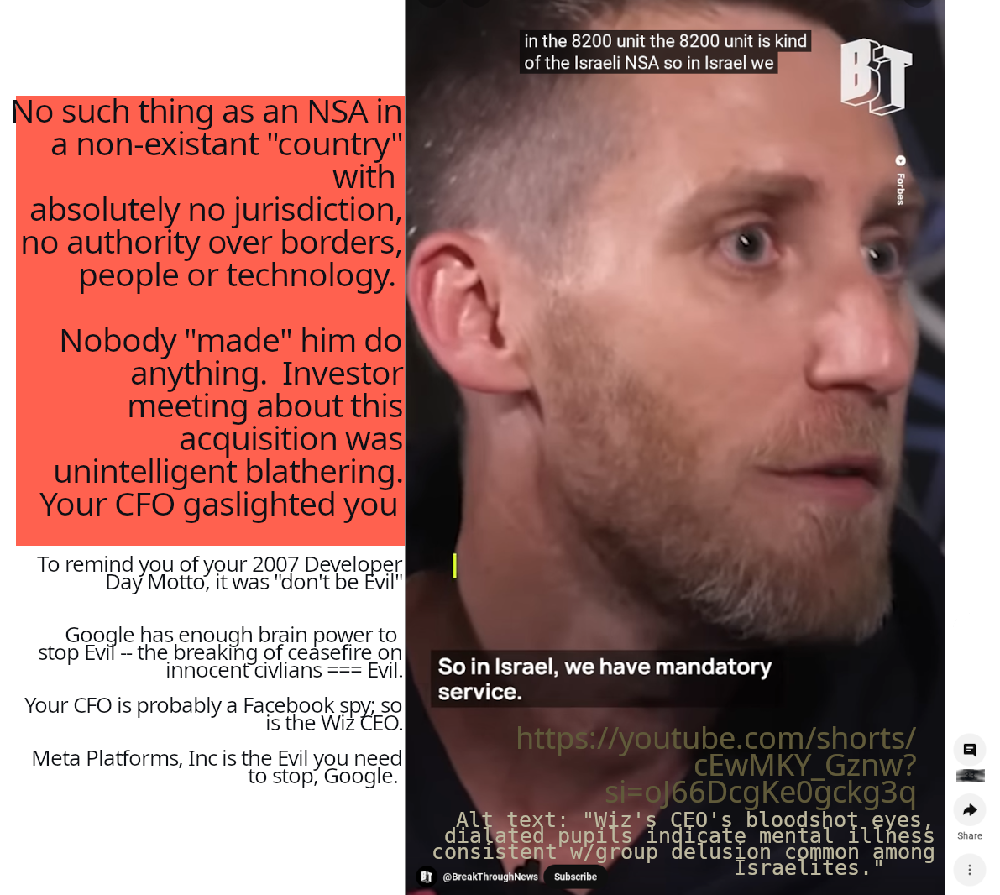
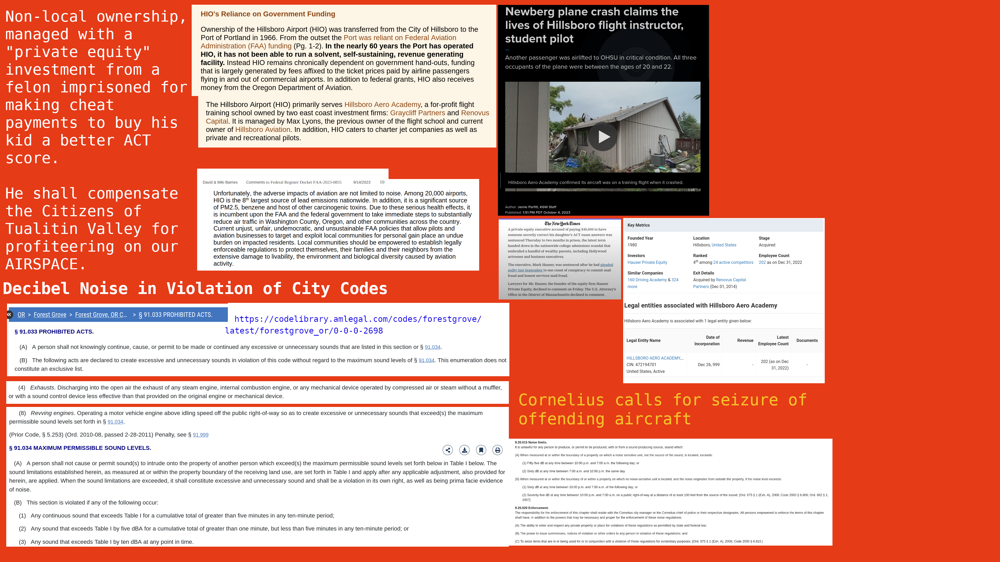

# Open-Source CIA

The content in this repository is meant to be used in conjunction with a #Tensorflow application. 

The content in this repository will answer the following questions: 

## HOW GOOGLE GAVE ONE TRILLION DOLLARS OF ITS MARKET CAP TO COLLEGE DROPOUT CEO'S META SINCE OCTOBER 7 2023
## HOW GOOGLE IS GIVING ITS MARKET CAP TO ALEX KARP'S FESTERING PIMPLE

The only thing that unites Israel is their hatred of Palestine peoples.

Executive summary backup URL: https://www.moomoo.com/community/feed/if-i-could-sit-down-and-have-a-conversation-with-114201856507909?futusource=nnq_personal_guest&feed_source=12

**FULL VERSION HERE**

#### "Hey Google! I'd be a great remote technician for any Tensorflow application documentation"  
---
Since I lived in Silicon Valley way back when Larry, Sergey and Marissa were getting their recently-IPO'd company off the ground, I did my due diligence on them all 
way back then ... as a college grad, I liked and trusted all of them to do what they said they wanted to do with the company. Especially that "don't be Evil" part.  
And like most people who camped or resided within a CalTrain ride's distance to  $Alphabet-C (GOOG.US)$  Mountain View campuses, I would have loved to work for Google 
back then. There is no doubt in my mind that a majority of things would be totally different and better for the majority of people alive today .... if you guys had only 
given me a team and a chance.  Like I told everybody in the column about [All the Native American Leadership Missing in Corporate America], I am who you need to hire to sustain your business -- not 
people who respond to damage on their ego with physical violence.  The absurdity.

Living on the peninsula, I learned to hide my MBA  and Accountancy degrees like I should be ashamed of being the first of my family to graduate college. Knowing and being 
able to teach corporations about kanban and kaizen and that there are *technically* at least three different  kinds of accounting, depending on the professional standards' 
boards of the CMA or CFA or CPA isn't a bad thing.  Each professional certification (that is what the "C" stands for in each acronym) has legal and regulatory considerations 

-- and each has an industry-standard of ethics to consider when working with money ...

✔️  to fund, 
✔️  to run,  
✔️  to sustain with audited money in  a business.  

I felt mostly hate living, trying to survive in Silicon Valley. People in Silicon Valley hated business-minded brains back then.  It was "too soon" after the dotcom crash of 
the 00s, ... and they blamed "Wall Street".  So I worked as a self-taught tech.  But what I self-taught was just never "good enough" for more than 20 dollars per hour 
(the max rate I made the 7 years I lived there).  That 2006 rejection email for the job of "Technical Writer" hurt me a lot, for a long time; it hurt my mom, too.  She was my 
family's #MMIW before I even knew what native people we descend from. 

When I count my blessings, divorce is always at the top of my list. And it was near the top of hers, too, when she met my parent (that story is on a webpage you already indexed).  
By the time I was 26 years old, I naively thought you could help me find her.  I was sending you my application from my apartment that had no heat; couldn't afford the gas bill 
and I needed the electric for computer.  That was a tough, dark time for me after my divorce from the abusive alcoholic husband the Mormon bishops had coerced me into marrying 
too young, not even old enough to buy the booze I'd later become addicted to.  I found out later -- around the time I learned contracts entered into under coercion, fraud or 
deception are not legally valid -- that the Mormon bishops after the year 2000 had lied about many things .... maybe out of malice, maybe not.  But in any case, the 13 original 
Colonies did everything they could to rip the rug out from the matriarchal, and female leadership-run tribal systems we already had when the Italian drunk named Christopher Columbus 
got lost at sea. 

Columbus was probably quite a lot like the drunk I divorced who went apeshit after I was earning more than him out of school, at age 25.  And sabotaged I was -- just like Gabby 
Petito's partner was demeaning, dismissive and fearful of her success, mine have been too.  That saboteur personality seems to be part of almost every aspiring tech bro I ever 
meet:  as long as he's being paid more than me, has more "followers", he can keep telling himself he's better than me, worth more to the planet than me.  You, Google, have a big
part in this wrong. Do you understand anything about the phrase "level the playing field"?  Your purchase of Wiz.io is essentially FUNDING YOUR ENEMY Facebook.  And I will explain 
here why. 

But first, a compliment:  I have three younger brothers older / more mature than college dropout CEO; I know how the male brain thinks and works.  But not all Googlers today are 
stereotypical "tech bro", right?  why I am making my "begging a group of Googlers" post to you specifically.  Larry took all stock, and a salary of one dollar one of those early 
years; I admired that.  That is what a worthy chief founder does.  But that is what a CFO exploits.

Your CFO replacing Ruth P was (no nice way to put this) the wrong choice, in my humble opinion. [Aside from the fact that Ashkenazi is probably closely related] ...maybe the first or 
second cousin of college dropout CEO... Ashkenazi also came from the pharmaceutical  industry, the same as college dropout CEO's biological parent.  This is the CFO that coerced you
to THROW AWAY THE EQUITY OF MANY YOUTUBE CONTENT CREATORS.  Her narcissism steals from people like me and gives more to the genocidal Zionists.

THAT IS NOT YOU GOOGLE.  You are so big now, but you cannot forget who you are.

Addiction is NOT what Google sells -- addiction is what Meta sells.  I listened to the whole broadcast w/presentation slides. I listened with my 33 years of experience since being 
designated as a "future scientist", and I did not hear anything compelling justifying the larger price tag.  Greedy people make me want to Ralph all over my thriftstore clothes... and it's 
not because I'm trying to earn enough to pay my electric bill THIS MONTH.    I'd rather be documenting any old boring API than not getting paid to write these columns. 

Is Bertha's inference engine making any outputs yet on where we might be going with this conversation?  Did you know that while I was employed at Intel, I succesfully got cleaner
markdown-based Tensorflow doc PULL REQUEST ACCEPTED into the main Tensorflow tree?

I see and have always seen Google as a search engine that can help people avoid stupid mistakes ... so why you made this mistake specifically with this CFO is incredibly baffling to me.  

I suspect certain large shareholders were targeted specifically to not really notice this lower-profile employee replacement.  I write today because I have spent time of my life (time 
I could have been doing other things) putting  together a theory.  It's not pretty, and people who follow my Moos because they hate/fear me won't like it.  I know people who hate me for 
my talent, but that is not my problem. I suspect the new employee was pushed through during chaotic or vulnerable times in the major shareholder's life -- maybe a midlife crisis, or some 
other normal human challenge of aging, when maybe the level of research was amateur, he expected that "by now" other people would care as much as you used to.    

Today I need your help, along with Moomoo followers ... help warding off the evil and insanity of the dilated pupils guy.  He claims somebody made his fake NSA service "mandatory", but 
yet he was free to reject the 23 billion dollar offer from 7 months ago?  This is logical fallacy.  You have enough insider information at Google to make the right search terms that prove 
my theory.  

That guy who rebranded his company logo to the "limitless credit card" sign of infinity has done more damage than he could ever clean up... and giving an "all cash deal" to his partners 
would be one of the dumbest things you can do.  I hope you figure out what you can do to stop him before it is too late.

Column CC'd many places elsewhere on the Internet where Larry and Sergey might also see or read it -- please share it with them directly if you are in a position to do so.

DATA for [Data Sifter.mqe]

This repo is SHARED with the evidence locker documenting proof that the  SNEERING WHITE CEO OF FACEBOOK he murdered Simon, [kitty programmer].
The manager of this airport is a lowlife scumbag, tax evader, friends with the murderer.  OF COURSE HE IS; 
College Dropout CEO cheated his way into Harvard BEFORE he stole the Winklevoss' code and before he stole everything else.

The murderer flew in an airplane -- and he landed at an Airport

FULL URL DATA_SOURCES IN FOOTNOTES

[Google Drive with video documentation of Meta's CEO's airplane harassment addiction]:https://drive.google.com/drive/folders/1k_nfGhD70Qs6tkKyYlEv-mO5_3-GvMEN?usp=sharing
[kitty programmer]:https://github.com/indie/kittyprogrammer
[All the Native American Leadership Missing in Corporate America]:https://www.moomoo.com/community/feed/all-the-native-american-leadership-missing-in-corporate-america-114104729403797?
[Aside from the fact that Ashkenazi is probably closely related]:https://www.youtube.com/watch?v=Y614o2-sBbo
[DataSifter.mqe]:https://www.moomoo.com/community/feed/datasifter-dot-mqe-115254908354965?share_code=0uQ4iB
